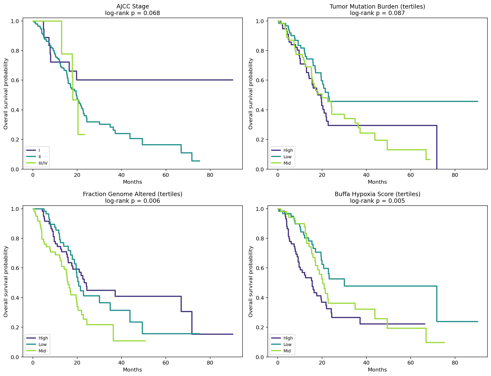
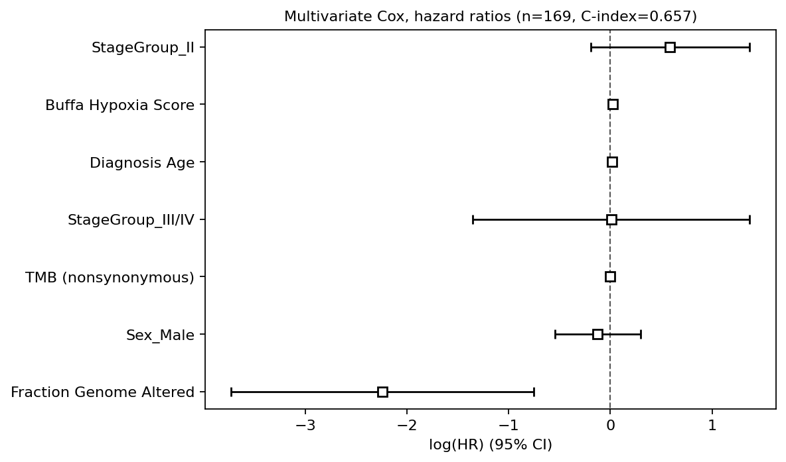
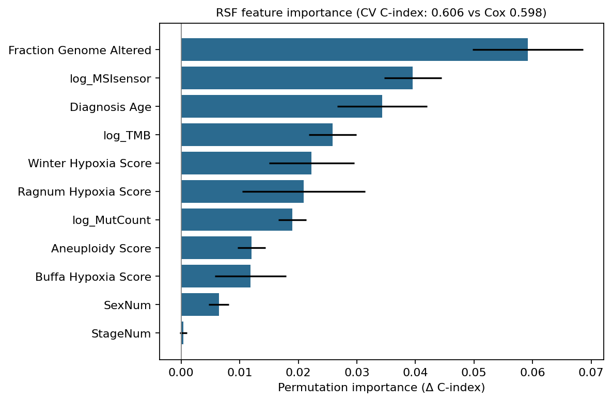
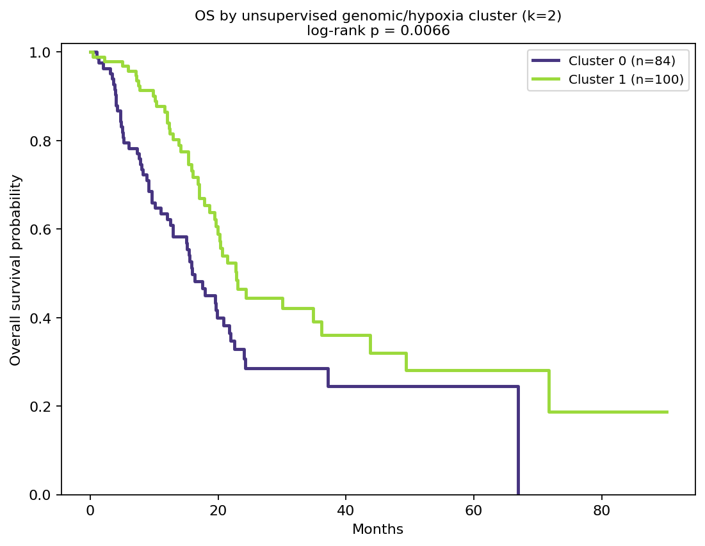

# Multi-Layer Prognostic Analysis of Pancreatic Adenocarcinoma (TCGA-PAAD)

*Integrating clinical, mutation-burden, copy-number, and hypoxia-signature features to
identify and validate prognostic markers in pancreatic ductal adenocarcinoma, using the
TCGA PanCancer Atlas cohort.*

---

## Objective

Pancreatic adenocarcinoma (PDAC) remains one of the most lethal solid tumors, and AJCC
stage alone doesn't tell you much about who's actually high risk. This project asks a
simple question: do genomic burden and transcriptomic signature features, layered on
top of routine clinical variables, help identify high-risk patients better than staging
alone? And can that signal be found, and properly validated, using only public data?

The analysis moves through three phases, each one checking the phase before it. That
structure, not just the final numbers, is the point: it's meant to show what it looks
like to treat a surprising result as a question rather than an answer.

## Data

**Cohort:** TCGA-PAAD, PanCancer Atlas (2018), pulled from cBioPortal. 184 patients
with usable overall survival data (99 deaths). Features used: AJCC stage, age, sex,
tumor mutation burden (TMB), fraction of genome altered (FGA), aneuploidy score, three
independent hypoxia gene-expression signatures (Buffa, Ragnum, Winter), MSIsensor
score, and total mutation count.

**Note on scope:** this analysis uses TCGA's pre-computed genomic *summary* scores
(TMB, FGA, hypoxia signatures) rather than raw mutation calls or a full expression
matrix. That's a deliberate choice given n=184, not a shortcut, and extending to
gene-level and expression-matrix data is the natural next step (see **Future
Directions**).

## Methods & Results

### Phase 1: Classical survival analysis

I fit Kaplan-Meier curves for AJCC stage, TMB tertiles, FGA tertiles, and hypoxia score
tertiles, then a multivariate Cox proportional hazards model including age, sex, stage,
TMB, FGA, and Buffa hypoxia score.




**Result:** Buffa hypoxia score was the strongest independent predictor of survival
(HR 1.025 per unit, p = 0.0001), and it held up even after adjusting for stage and age.
AJCC stage itself wasn't independently significant once hypoxia was in the model.
Unexpectedly, FGA came out with a *protective* hazard ratio (HR 0.11, p = 0.003), the
opposite of what genomic instability biology would predict.

**Flag:** I didn't take the FGA result at face value. A counterintuitive coefficient in
a multivariate model is a classic sign of collinearity between predictors, and FGA was
a natural candidate to double-check against a method that doesn't assume any linear
structure.

### Phase 2: ML validation

I benchmarked a Random Survival Forest against the Cox model using 5-fold
cross-validation (concordance index), to test whether nonlinear or interaction effects
were being missed by the linear model, and to rank features by permutation importance.



**Result:** Cox (0.598 ± 0.084) and RSF (0.606 ± 0.103) performed about the same. I'm
reporting that as-is rather than reaching for an "ML wins" narrative, because with this
feature set and sample size, the extra flexibility of a forest just doesn't translate
into better discrimination. Permutation importance ranked FGA, MSIsensor score, and age
as the top predictors, with AJCC stage contributing almost nothing.

### Phase 3: Unsupervised discovery

I clustered patients on genomic burden and hypoxia features alone, giving the algorithm
no survival information at all, to see whether natural molecular subgroups exist and
whether they relate to outcome.



**Result:** two clusters emerged (silhouette-selected, k=2) and differed significantly
in survival (log-rank p = 0.0066). The cluster with **higher** FGA, aneuploidy, and
hypoxia scores had **worse** survival (64% death rate, median OS 14.8 months) than the
low-burden cluster (45% death rate, median OS 15.9 months), which is the direction
you'd actually expect biologically.

**Resolution:** this directly contradicts the sign of FGA's coefficient from the Phase
1 Cox model. The most likely explanation is that FGA and hypoxia score are correlated
enough that the linear model's coefficients got distorted by collinearity. Once hypoxia
absorbed the instability signal, FGA's fitted coefficient flipped to compensate.
**Conclusion: trust the hypoxia signal, and don't report the raw multivariate FGA
hazard ratio without this caveat.**

## Discussion

The headline finding is that a hypoxia gene-expression signature is a more robust
prognostic marker than AJCC stage in this cohort, a real, if preliminary, case for
transcriptomic risk stratification alongside routine staging in PDAC. It also connects
to a therapeutic class already being trialed in pancreatic cancer: hypoxia-activated
prodrugs like evofosfamide.

Just as important is what happened with the analysis itself. A single multivariate
model produced a misleading coefficient, and the only reason it got caught was
deliberately cross-checking it against an independent, non-parametric method. Treating
a counterintuitive result as something to verify, rather than something to report as
is, is really the methodological core of this project.

## Limitations

- n=184 is modest for machine learning, so these results should be read as
  hypothesis-generating, not clinically validated.
- There's no external or held-out cohort. Cross-validation protects against
  overfitting to noise within this cohort, but not against cohort-specific biases,
  like the fact that TCGA-PAAD is enriched for resected, treatment-naive tumors.
- The analysis uses genomic summary scores, not gene-level mutation calls or a raw
  expression matrix.

## Repository structure

```
paad-pdac-survival-analysis/
├── paad_full_analysis.ipynb   analysis notebook (run this)
├── data/                      input clinical data + provenance
├── figures/                   output plots
├── results/                   output tables
└── requirements.txt
```

## Reproducing this analysis

```
git clone https://github.com/<your-username>/paad-pdac-survival-analysis.git
cd paad-pdac-survival-analysis
pip install -r requirements.txt
jupyter notebook paad_full_analysis.ipynb
```

Run the notebook top to bottom from the repo root; the paths inside are already
relative, so no editing needed. It regenerates everything in `figures/` and
`results/` from the data in `data/`.
